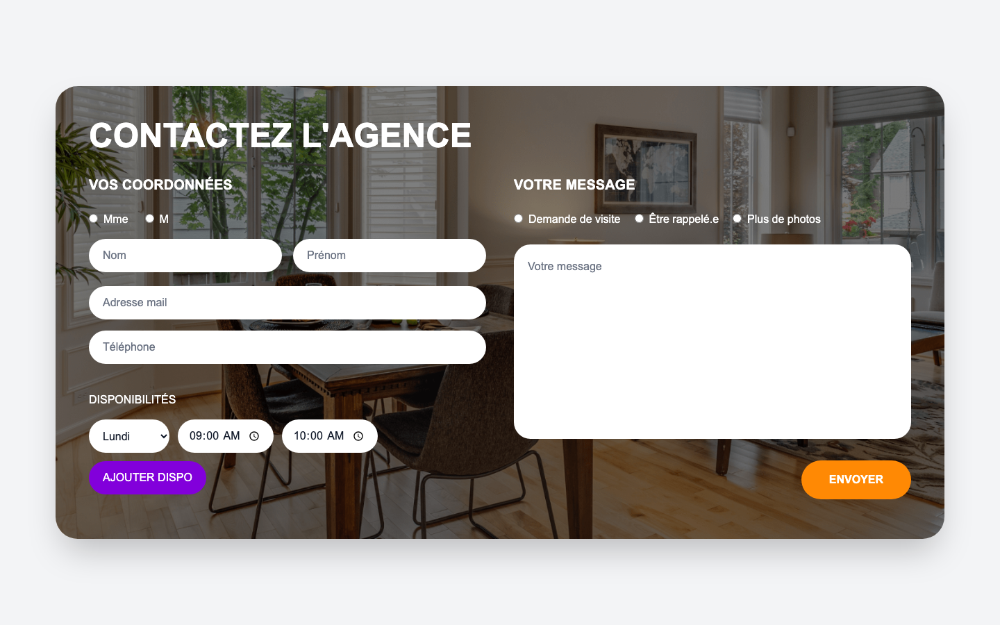
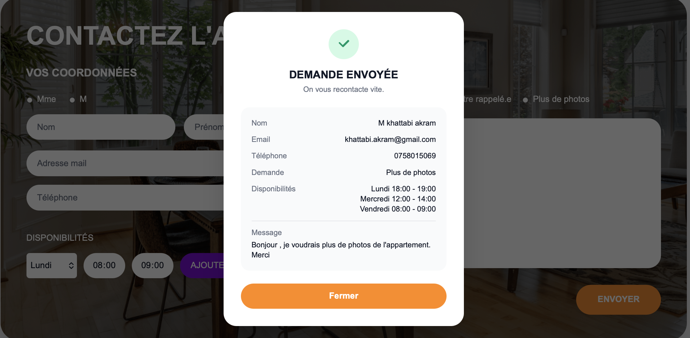

# — Formulaire de contact agence immobilière

Application web composée d'un formulaire de contact (coordonnées, type de
demande, disponibilités) avec un frontend React et une API backend FastAPI
qui enregistre chaque demande en base de données.

## À propos de moi

- **Nom / prénom :** Akram Khattabi
- **Niveau d'étude / formation en cours :** Master 2 — Intelligence Artificielle & Data Management, ECE Paris (2025–2026)
- **Durée de stage souhaitée :** Stage de fin d'études (PFE), 6 mois
- **Liens :**
  - GitHub : [github.com/AkramKhattabi](https://github.com/AkramKhattabi)
  - LinkedIn : [linkedin.com/in/akram-khattabi](https://linkedin.com/in/akram-khattabi)
  - Portfolio : [portfolio.thestudyadvisor.org](https://portfolio.thestudyadvisor.org)

## Screenshots

Page principale (formulaire de contact) :



Confirmation après envoi (récapitulatif de la demande) :



## Stack technique & choix

**Framework**
- React 19 (Vite, TypeScript) — pas Next.js : l'exercice ne demandait qu'une
  page unique sans besoin de routing serveur ni de SSR, Vite suffit et reste
  plus rapide en développement.

**Outils et librairies principales**
- **Tailwind CSS v4** — permet de styliser rapidement sans sortir du fichier
  composant, utile pour un rendu fidèle à la maquette en peu de temps.
- **React Hook Form + Zod** — gestion de formulaire performante (peu de
  re-renders) avec une validation typée et partagée en un seul schéma.
- **Axios** — client HTTP avec une API plus simple que fetch pour gérer les
  erreurs et les headers.
- **Vitest** — même écosystème que Vite, pas de configuration supplémentaire
  pour les tests unitaires côté frontend.
- **FastAPI + Pydantic** (backend) — validation des données reçues côté
  serveur, cohérente avec les règles définies côté frontend (Zod).
- **SQLAlchemy + SQLite** (backend) — persistance simple sans serveur de base
  de données à installer pour ce périmètre.
- **Pytest** (backend) — tests de la route API avec une base SQLite dédiée en
  mémoire.

## Lancement du projet

```bash
# Installation — frontend
cd frontend
npm install

# Installation — backend (nécessite Python 3)
cd backend
python3 -m venv .venv
.venv/bin/pip install -r requirements-dev.txt
```

```bash
# Lancer le frontend et le backend en même temps
cd frontend
npm run dev
```

L'application est ensuite accessible sur http://localhost:5173.

**Séparément, si besoin de déboguer l'un des deux :**

```bash
# Terminal 1 — backend seul, http://localhost:8001
cd frontend
npm run dev:api

# Terminal 2 — frontend seul, http://localhost:5173
cd frontend
npm run dev:client
```

**Tests :**

```bash
# Frontend (validation du schéma Zod)
cd frontend
npm test

# Backend (route POST /api/contact)
cd backend
.venv/bin/python -m pytest test_main.py -v
```

## Questions

**Avez-vous trouvé l'exercice facile ou difficile ? Qu'est-ce qui vous a posé problème ?**

Plutôt facile dans l'ensemble, c'est un exercice assez classique. Le seul
truc qui m'a fait réfléchir un peu plus, c'est la gestion des disponibilités
multiples (en ajouter/retirer plusieurs avant l'envoi) et garder les mêmes
règles de validation entre le frontend et le backend sans tout dupliquer.

**Avez-vous appris de nouveaux outils pour répondre à l'exercice ? Si oui, lesquels ?**

Oui, j'avais peu pratiqué React Hook Form combiné à Zod (`@hookform/resolvers`),
donc j'en ai profité pour creuser ça. J'ai aussi mis en place un proxy Vite
pour faire parler le frontend et le backend sans m'embêter avec le CORS.

**Quelle est la place du développement web dans votre cursus de formation ?**

Mon master actuel est surtout tourné IA (ML, deep learning, NLP), mais le
dev web reste une grosse partie de mon profil grâce à mes 3 ans d'expérience
en full-stack avant cette formation. Je m'en sers encore aujourd'hui pour
mettre une interface sur mes projets d'IA persos.

**Avez-vous utilisé un LLM ? Si oui, comment intégrez-vous les LLM à chaque étape de votre workflow ?**

Oui, et ce n'est pas nouveau pour moi, plusieurs de mes projets perso (Multi
LLM RAG, Ticket AI Analyser...) sont justement construits autour de LLMs.

Pour ce test précis, j'ai utilisé Claude Code pour poser rapidement le
squelette du projet, puis pour relire le code et écrire ce README. Mais je
garde toujours la main sur les décisions importantes (choix de stack, règles
de validation) et je relis tout avant de valider : un LLM peut se tromper,
donc rien ne part sans que je l'aie relu.

## Structure du projet

```
test-majordhom/
├── frontend/
│   └── src/
│       ├── components/ContactForm.tsx   # Formulaire (validation, envoi, modale de retour)
│       ├── lib/contactSchema.ts         # Règles de validation Zod (cf. backend/schemas.py)
│       ├── services/contactservice.ts   # Appel HTTP vers l'API
│       ├── pages/Home.tsx               # Page unique
│       └── types/contact.ts
└── backend/
    ├── main.py        # Routes FastAPI
    ├── models.py      # Modèle SQLAlchemy (table contact_requests)
    ├── schemas.py     # Validation Pydantic (mêmes règles que Zod côté front)
    ├── database.py    # Connexion SQLite
    └── test_main.py   # Tests de l'API
```

Le frontend et le backend sont volontairement deux applications séparées
(deux ports, deux process) reliées en développement par un proxy Vite
(voir `vite.config.ts`) : `/api/*` est redirigé vers `http://localhost:8001`.
